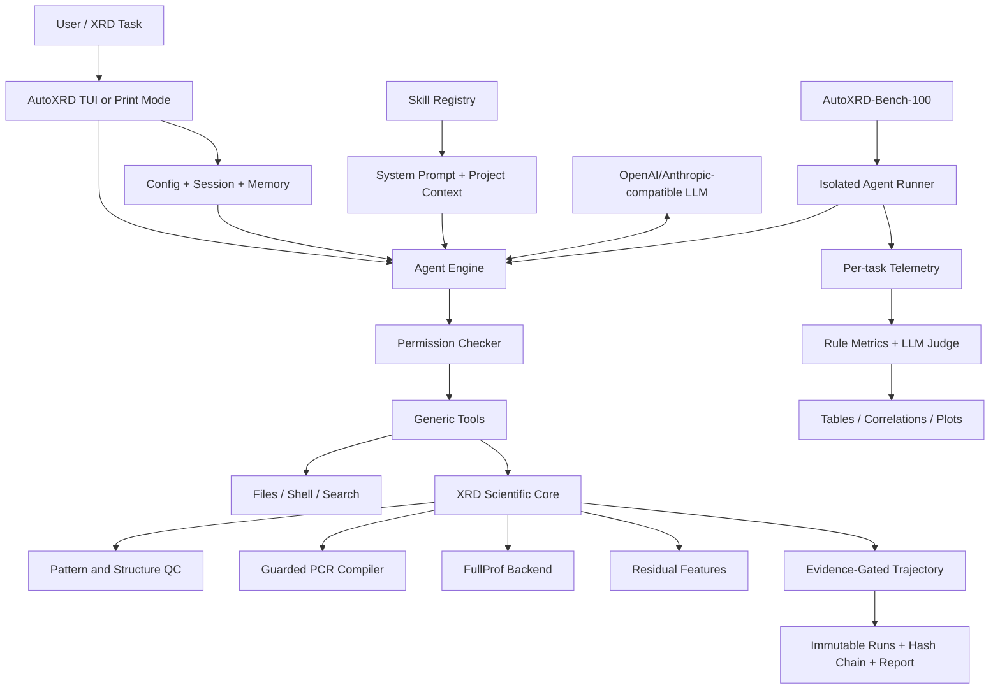
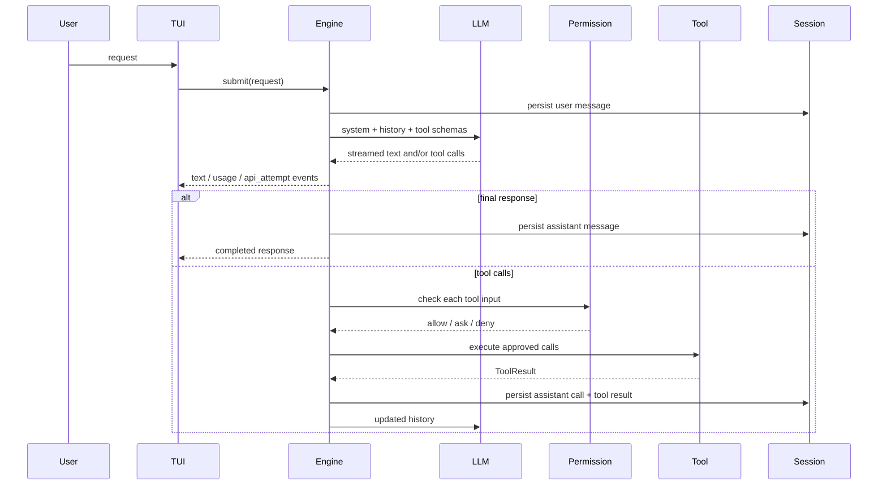
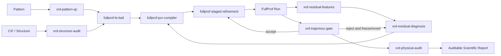
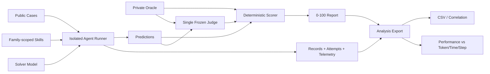

# AutoXRD Framework

本文档描述当前代码库中已经实现的 AutoXRD 架构、模块边界、运行时数据流、科学工作流与评测系统。它既是工程说明，也是后续绘制系统总览图、Agent 循环图、Rietveld 工作流图和 benchmark 图的结构依据。

## 1. 系统定位

AutoXRD 是一个面向粉末 X 射线衍射分析与可审计 Rietveld refinement 的 terminal-UI Agent。系统将职责拆为三类：

1. **LLM 负责规划与解释**：理解任务、选择领域 skill、读取证据、提出下一步受约束动作并生成科学结论。
2. **确定性程序负责计算**：解析谱图/CIF/PCR/PRF，执行 FullProf，提取残差特征和 refinement metrics。
3. **validator 与 gate 负责约束**：检查 action 合法性、PCR 修改范围、物理边界、可证伪预测和多目标 utility，决定一次 refinement 是否接受。

核心原则是：

> LLM plans; crystallographic software computes; deterministic validators constrain; evidence gates accept or reject.

因此，AutoXRD 不是“让 LLM 自由改 PCR 并追求最低 Rwp”的脚本，而是一个 typed、physics-constrained、trajectory-auditable 的科学 Agent 环境。

## 2. 总体分层架构

当前系统可以划分为六层。

| 层 | 核心职责 | 主要实现 |
|---|---|---|
| Interaction | 命令行参数、TUI、流式输出、会话恢复、快捷命令 | `src/tui/`, `src/commands/` |
| Agent Runtime | LLM/tool 循环、重试、并行只读工具、工具预算、消息持久化 | `src/core/engine.py`, `src/core/llm.py` |
| Control & Safety | 权限、sandbox、plan/coordinator、worker、context compact、memory | `src/core/permissions.py`, `src/features/` |
| Skill Layer | 将专家流程编码为可发现、可注入的 `SKILL.md` | `.autoxrd/skills/`, `src/features/skills.py` |
| XRD Scientific Core | 确定性谱图/CIF/PCR/PRF 处理、FullProf、残差、trajectory gate | `src/xrd/` |
| Evaluation | AutoXRD-Bench-100、隔离 runner、Judge、批实验、telemetry 和分析 | `benchmarks/`, `src/xrd/benchmark_v2.py` |

### 2.1 总体结构图



建议论文总图将 Interaction/Runtime 画为灰色通用 Agent 基座，Skill Layer 画为黄色决策层，XRD Core 画为蓝色确定性科学层，Gate 画为红色约束层，Evaluation 画为绿色实验层。

## 3. 交互与启动层

### 3.1 程序入口

Python package 在 `pyproject.toml` 中注册：

```text
autoxrd = tui.app:main
```

典型启动命令：

```bash
autoxrd --auto-approve
```

`src/tui/app.py` 完成以下装配：

1. 解析 provider、model、base URL、token limit、effort、resume 和 coordinator 参数。
2. 加载全局/项目 TOML 配置与环境变量。
3. 初始化 sandbox、memory、session、skills、permission checker 和 cost tracker。
4. 构建主 Engine、worker Engine 与只读 Explore Engine。
5. 注册通用工具、plan 工具、todo 工具和可选 coordinator 工具。
6. 在 interactive REPL 或 `--print` 非交互模式中提交用户请求。

### 3.2 配置优先级

配置由 `src/core/config.py` 统一解析。主要来源是 CLI、环境变量、项目 `.autoxrd.toml` 和用户配置 `~/.config/autoxrd/config.toml`。运行时统一形成 `AppConfig`：

```text
provider, api_key, base_url, model, max_tokens, effort,
buddy_model, memory_dir, auto_dream, advisor_model, advisor_max_uses
```

API credential 只进入 LLM client，不应写入 session、benchmark manifest 或日志。

## 4. Agent Runtime

### 4.1 Engine 的职责

`src/core/engine.py::Engine` 是系统的中心状态机。它维护：

- system prompt 与 conversation messages；
- provider-neutral `LLMClient`；
- name-to-tool registry；
- permission checker；
- session store 与 cost tracker；
- abort/rollback 状态；
- advisor 和每轮 tool-call budget。

Engine 对外提供事件流，而不是直接绑定 TUI。主要事件包括：

```text
text
waiting
api_attempt
usage
tool_call
tool_executing
tool_result
error
```

这一事件接口同时服务交互式 TUI 和 benchmark telemetry。

### 4.2 单轮 Agent 循环



执行语义：

- 连续的只读工具可在一个 batch 中并行执行；写入或有副作用的工具串行执行。
- retryable API error 使用 exponential backoff、jitter 和 `Retry-After`。
- context overflow 会降低输出 token 上限后重试。
- Esc/Ctrl+C 可关闭活动 stream，并回滚未完成 turn 的 messages。
- benchmark 可设置 `max_tool_calls=20`；第 21 个请求导致该 case 失败。

### 4.3 Provider 抽象

`src/core/llm.py` 将 OpenAI-compatible 和 Anthropic 消息统一为：

```text
LLMMessage {
  content: [text | tool_use],
  usage: LLMUsage,
  stop_reason
}
```

LLM 层处理消息格式转换、stream aggregation、tool-call JSON 组装、usage normalization 和 provider error classification。上层 Engine 不依赖特定 SDK 响应结构。

## 5. 工具、权限与控制模块

### 5.1 通用工具

`src/tools/` 提供：

| 类别 | 工具 |
|---|---|
| 文件读取/搜索 | `Read`, `Glob`, `Grep` |
| 文件修改 | `Edit`, `Write` |
| 系统执行 | `Bash` |
| 人机交互 | `AskUserQuestion` |
| 任务管理 | `TodoWrite`, `TodoUpdate` |
| 计划模式 | `EnterPlanMode`, `ExitPlanMode` |
| 多 Agent | `Agent`, `SendMessage`, `TaskStop` |

所有工具实现统一的 `Tool`/`ToolResult` contract，并由 Engine 转成 provider tool schema。

### 5.2 Permission 与 Sandbox

`PermissionChecker` 在执行前根据 auto-approve、plan mode 和 sandbox policy 决定 allow/ask/deny。`src/features/sandbox/` 负责命令匹配、配置加载、wrapper 和 sandbox lifecycle。

benchmark 使用更严格的独立边界：

- Read/Glob/Grep 只能访问单个 case workspace；
- Bash 在 `--network none`、read-only root filesystem、drop capabilities 的 Docker 中运行；
- container 只挂载当前 case workspace；
- solver 看不到 oracle、其他 case、历史结果和 Git 数据。

### 5.3 Session、Memory 与 Compact

- `src/core/session.py`：append-only conversation session 和 resume。
- `src/features/memory.py`：长期 memory、daily log 和 dream consolidation。
- `src/features/compact.py`：上下文估算与压缩。
- `src/features/cost_tracker.py`：模型级 token、API time 和可用时的费用统计。
- `src/features/plan.py`：只读探索与 plan-mode 权限约束。
- `src/features/agents/`：worker/Explore engine 管理和后台通知。

这些属于通用 Agent substrate，不直接实现 XRD 物理，但为长链科学任务提供状态、成本、恢复和并行探索能力。

## 6. Skill Layer

### 6.1 Skill 机制

Skill 是含 YAML frontmatter 的 `SKILL.md`。`src/features/skills.py` 负责解析、注册、发现和 prompt 注入。来源按层次分为：

1. bundled skills；
2. `~/.autoxrd/skills/` 用户 skills；
3. `<project>/.autoxrd/skills/` 项目 skills。

关键 metadata 包括：

```text
name, description, when_to_use, allowed_tools,
user_invocable, context, model, paths, arguments
```

Skill 不替代确定性代码。它主要编码“何时调用哪个程序、需要检查什么证据、何种结论不可接受、下一步动作如何受限”。

### 6.2 当前 9 个 XRD skills

| Skill | 输入/触发条件 | 主要输出或约束 |
|---|---|---|
| `xrd-pattern-qc` | 原始 XRD pattern | scan/QC 状态、noise、peak sampling、warnings |
| `xrd-structure-audit` | candidate CIF | formula/space group/cell/site/occupancy/距离审计 |
| `fullprof-le-bail` | trusted PCR template + pattern | 合法的首轮 Le Bail/profile matching run |
| `fullprof-pcr-compiler` | PCR + typed action spec | 最小 codeword 修改与 provenance report |
| `fullprof-staged-refinement` | 已通过 QC 的 pattern/structure/template | 分阶段 refinement curriculum |
| `xrd-residual-features` | PRF 或 obs/calc table | 局部 signed residual、bias、autocorrelation、missing peaks |
| `xrd-residual-diagnosis` | residual features + history | ranked causes、disambiguation、一个最小 next action |
| `xrd-trajectory-gate` | before/action/after | accept/reject、预测满足情况、utility delta |
| `xrd-physical-audit` | refined model + metrics | hard violations、多假设排序、最终科学审计 |

### 6.3 Skill 依赖图



这张图应画成循环而非线性 pipeline，因为 rejected action 是下一轮诊断证据，而不是被丢弃的失败。

## 7. XRD Scientific Core

### 7.1 Pattern 与 structure 边界检查

`src/xrd/pattern.py` 支持 JSON、XRDML、text/CSV-like 和 CPI pattern，输出 `Pattern` 与 `PatternQC`。检查包括点数、角度范围、步长规律、强度、robust noise、peak sampling 和异常警告。

`src/xrd/structure.py` 通过 pymatgen 读取 CIF，并执行 formula、lattice、occupancy、site 和 minimum-distance 等保守审计。通过审计只表示结构文件物理上可解析，不表示相鉴定正确。

### 7.2 Guarded PCR Compiler

`src/xrd/pcr.py` 将脆弱的 FullProf PCR 修改转成 typed compilation：

1. `parse_pcr` 构建 `PCRDocument`、phase control 与 codeword catalog。
2. validator 检查 MVP/Le Bail 模式和 action-stage 合法性。
3. `compile_action` 先冻结 catalogued codewords，再只释放 action 指定 selectors。
4. 编译器校验 template SHA256，拒绝越界 selector、unsupported mode 和跨 action boundary 修改。
5. 输出新 PCR，不覆盖 source，并生成 `CompilationReport`。

当前编译器支持 scale、zero、background、lattice、profile 和 asymmetry。positions、Biso、occupancy、preferred orientation 与 size/strain 仍保持拒绝状态，直到 bounds、restraints 和 refined-value parsing 完整实现。

### 7.3 FullProf Adapter

`src/xrd/fullprof.py` 是 FullProf 的确定性 adapter：

- 将 trusted template 与 pattern 复制到独立 workdir；
- 调用外部 FullProf executable；
- 记录 return code 和 runtime；
- 解析 Rp、Rwp、Rexp、Chi2、global weighted Chi2、Bragg R、phase fraction、convergence、warnings 和 artifacts。

`src/xrd/le_bail.py` 提供经过验证的首轮 Le Bail initialization。系统当前的数值 refinement backend 是 FullProf；proposal 中的 GSAS-II、BGMN、Optuna 和自动 phase retrieval 属于扩展接口，不应在当前架构图中画成已实现模块。

### 7.4 Residual Feature Engine

`src/xrd/residual.py` 从通用 obs/calc table 或 FullProf PRF 提取：

- Rwp consistency metric；
- low/high-angle signed bias；
- residual autocorrelation；
- localized positive/negative structured regions；
- unexplained-peak ratio；
- structured-region fraction。

LLM skill 使用这些可复现特征诊断 zero、cell、profile、asymmetry、background、preferred orientation 或 missing phase，而不是仅依据总 Rwp 猜测原因。

## 8. Typed Action 与 Evidence Gate

### 8.1 核心数据结构

`src/xrd/schemas.py` 定义科学状态转换 contract：

```text
RefinementStage =
  qc | profile_match | instrument | structure | microstructure | final_audit

RefinementAction = {
  kind,
  stage,
  parameters,
  rationale,
  evidence: Evidence[],
  predictions: FalsifiablePrediction[],
  bounds,
  parent_run_id
}

FitSnapshot = {
  rwp, rexp, gof,
  residual_score,
  unexplained_peak_ratio,
  physical_violations,
  parameter_count,
  max_abs_correlation,
  features
}

GateDecision = {
  accepted,
  mechanism_supported,
  reasons,
  satisfied_predictions,
  failed_predictions,
  utility_delta
}
```

Action kinds覆盖 scale、zero、background、lattice、profile、asymmetry、atomic positions、Biso、occupancy、orientation、size/strain、freeze、add/remove phase、exclude region 和 switch profile。

### 8.2 Gate 逻辑

`src/xrd/trajectory.py` 对每次状态变化进行以下检查：

1. action 是否允许出现在当前 refinement stage；
2. high-risk action 是否给出 bounds；
3. occupancy/Biso、zero/cell 等高耦合参数是否被错误同时释放；
4. action 的可证伪预测是否达到最小变化；
5. 是否引入新的 physical violation；
6. 参数数量、correlation、Rwp/GoF、residual 和 unexplained peaks 的多目标 utility 是否提高。

只有所有 hard gates 通过且 utility delta 为正时才接受。Rwp 降低本身不是 acceptance condition。

### 8.3 可审计轨迹

`TrajectoryStore` 为 append-only ledger。每个 run 保存：

```text
run_id, parent_hash, action, before, after, decision,
artifact paths, artifact SHA256, run_hash
```

每条记录以 canonical JSON 计算 hash，并链接前一条 `parent_hash`。`verify()` 同时检查 hash chain、run record 和 artifact hashes。这样最终报告能够追溯 accepted/rejected actions 和对应原始证据。

### 8.4 Refinement 状态机

```mermaid
stateDiagram-v2
    [*] --> QC
    QC --> ProfileMatch: pattern/metadata valid
    ProfileMatch --> Instrument: positions/profile aligned
    Instrument --> Structure: stable scale/cell/background/profile
    Structure --> Microstructure: structure physically valid
    Microstructure --> FinalAudit: optional late-stage terms stable
    Structure --> FinalAudit: no microstructure action needed
    FinalAudit --> [*]: evidence and trajectory verified

    ProfileMatch --> ProfileMatch: reject action; freeze/revert
    Instrument --> Instrument: reject action; freeze/revert
    Structure --> Structure: reject action; freeze/revert
    Microstructure --> Microstructure: reject action; freeze/revert
```



## 9. AutoXRD-Bench-100 v2

### 9.1 Benchmark 组成

当前 benchmark 固定为 100 个 case：

| 难度 | 数量 | 答案类型 | 核心评估 |
|---|---:|---|---|
| Easy | 30 | 至少 4 个干扰项的 select-all | exact option-set match |
| Medium | 40 | metric-grounded conclusion/report | reference-guided LLM Judge |
| Hard | 30 | parameter recovery、QPA、phase identification | objective metrics + Judge |

family 包括 action/gate/residual reasoning、residual/trajectory/experimental report、metric recovery、QPA 和 phase identification。

### 9.2 Ground Truth 与评分

公开问题位于 `cases.jsonl`，evaluator-only reference 位于 `oracle.json`。Hard objective metrics 包括 phase F1、fraction MAE/RMSE、artifact accuracy 和 normalized parameter MAE/RMSE。

相对 utility 使用冻结的 baseline/oracle，而不依赖参与比较的模型：

```text
higher-is-better: clip((metric - baseline) / (oracle - baseline), 0, 1)
lower-is-better:  clip((baseline - metric) / (baseline - oracle), 0, 1)
```

每 case 最多 1 分，最终 overall 转成百分制。Medium 与 Hard explanation 的 Judge 输入同时包含 task、candidate、ground truth 和 case rubric。Judge 不向 solver 返回反馈。

### 9.3 隔离运行

`benchmarks/run_agent_benchmark.py` 为每个 case 创建独立 workspace，只复制公开 case、pattern 和与 family 对应的 skills。执行结束后原子写入：

```text
<run>/records/<case>.json              latest attempt
<run>/attempts/<case>/attempt-NNN.json immutable attempt
<run>/predictions.jsonl
<run>/report.json
```

状态语义：

- `ok`：获得可解析 response-schema JSON；
- `failed`：科学协议失败，例如请求第 21 个工具调用；
- `error`：API/transport/runner/invalid-response 错误；
- normal resume 保留三类已有记录；
- `--retry-errors-only` 只对 missing/error case 做一次恢复性尝试；
- `failed` 不因恢复运行而重试。

## 10. 多模型实验与 Telemetry

### 10.1 实验编排

`benchmarks/run_model_batch.py` 从 git-ignored local matrix 读取 model/base URL/key。公开 manifest 自动移除 key。实验协议为：

- 每个模型内 `workers=1`；
- 模型按固定顺序串行运行；
- 每 case 完成后立即 checkpoint；
- 单个模型 command failure 不阻止后续模型；
- solver 全部冻结后再执行统一 Judge；
- API errors 在所有 initial runs 结束后统一 recovery。

`benchmarks/probe_openai_model.py` 在正式运行前检查鉴权、model name、streaming、usage 和 stop reason。`benchmarks/run_queued_model.py` 可在 prerequisite batch 明确完成后追加单模型实验。

### 10.2 Per-task telemetry schema

每条 record 保存：

| 维度 | 字段 |
|---|---|
| Identity | id, family, difficulty, model/run metadata |
| Outcome | status, termination_reason, answer, errors |
| Recovery | attempt, run_phase, immutable attempt history |
| Token | input/output/cache/advisor/total tokens |
| Model | model_turn_count, per-turn usage, stop reason |
| API | api_attempt_count, api_retry_count, per-attempt latency/error |
| Tool | requested/executed/error calls, per-call input/duration/result size |
| Time | UTC start/end, wall, API, tool, non-API wall time |
| Steps | `agent_step_count = successful model turns + executed tool calls` |

工具上限单独使用 `tool_calls_requested` 判断，避免把被拒绝的第 21 次调用混入正常 executed steps。

### 10.3 论文分析输出

`benchmarks/analyze_agent_runs.py` 将 final report 与 per-task records join，输出：

- `task_metrics.csv`：case 级 score、tokens、time、steps、status；
- `model_summary.csv`：overall/difficulty/family 聚合；
- `correlations.json`：performance 与 token/time/step 的 Pearson、Spearman；
- `performance_vs_tokens.png`；
- `performance_vs_seconds.png`；
- `performance_vs_steps.png`。

推荐论文至少报告：overall、difficulty、family、missing/error/failed rate、mean/median tokens、wall time、API time、steps、retries，以及 performance-efficiency 关系。

### 10.4 Evaluation 数据流图



## 11. 关键目录映射

```text
AutoXRD/
├── src/
│   ├── tui/                 interaction and rendering
│   ├── commands/            slash-command parsing and dispatch
│   ├── core/                config, prompt, LLM, Engine, permission, session
│   ├── tools/               generic tool implementations
│   ├── features/            skills, memory, compact, plan, agents, sandbox, cost
│   └── xrd/                 deterministic XRD scientific core
├── .autoxrd/skills/         nine project XRD skills and scripts
├── benchmarks/
│   ├── autoxrd_bench_100/   cases, oracle, manifest, materialized patterns
│   ├── run_agent_benchmark.py
│   ├── judge_benchmark.py
│   ├── run_model_batch.py
│   ├── run_queued_model.py
│   └── analyze_agent_runs.py
├── resources/               papers/manuals/reference materials
├── tests/                   unit and integration tests
├── proposal.md              research motivation and target design
└── framework.md             current implementation architecture
```

## 12. 论文绘图建议

建议拆成四张图，而不是把全部信息堆在一张图中。

### Figure 1: AutoXRD system overview

从左到右画：

```text
User Inputs
  -> TUI / Agent Runtime
  -> Skill-Guided Planner
  -> Deterministic XRD Tools + FullProf
  -> Evidence Gate + Physical Audit
  -> Trajectory + Scientific Report
```

在 Planner 与 Tools 之间画双向循环；在 Gate 到 Planner 画 rejected feedback；在 Gate 到 Report 画 accepted trajectory。

### Figure 2: Evidence-gated refinement loop

中心循环节点：

```text
Observe State -> Diagnose Residual -> Propose Typed Action
-> Validate/Compile -> Run FullProf -> Parse Metrics
-> Test Prediction/Physics -> Accept or Reject -> Observe State
```

在 `Test Prediction/Physics` 下方列出 Rwp/Rexp、residual morphology、unexplained peaks、correlation、physical violations 和 complexity。

### Figure 3: AutoXRD-Bench evaluation

上半部分画 30 Easy / 40 Medium / 30 Hard；中间画 networkless isolated runner 和 20-call budget；下半部分把 objective scorer 与 frozen LLM Judge 合并为 0-100 score。

### Figure 4: Performance-efficiency analysis

画 solver model 到 per-task telemetry，再分叉到 performance、tokens、time、steps、API retry/status，最后形成 model/difficulty/family aggregation 与相关性图。

## 13. 当前边界与扩展点

当前已经实现的主链路包括：terminal Agent、OpenAI/Anthropic wire formats、工具/权限/sandbox、skills、pattern/CIF/PCR/PRF 处理、FullProf execution、residual features、typed action、evidence gate、hash-chain trajectory、AutoXRD-Bench-100、Judge 接口、批实验和 telemetry 分析。

以下仍是明确的扩展点，不应作为当前完成能力宣称：

- 自动连接 COD/Materials Project 的 candidate phase retrieval；
- 多候选 phase-set combinatorial search；
- GSAS-II/BGMN backend adapters；
- positions/Biso/occupancy/orientation/size-strain 的完整 guarded compiler；
- covariance matrix 和 refined uncertainty 的全格式解析；
- instrument profile 标定与多谱联合 refinement；
- 从 benchmark/专家轨迹自动蒸馏或训练 skills；
- 大规模 hidden test set 与跨实验室 external validation。

架构上，这些扩展应接入 Skill Layer 与 XRD Scientific Core，不应绕过 typed action、validator、trajectory gate 和 audit ledger。
