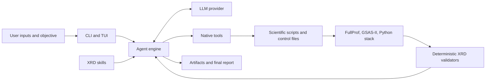
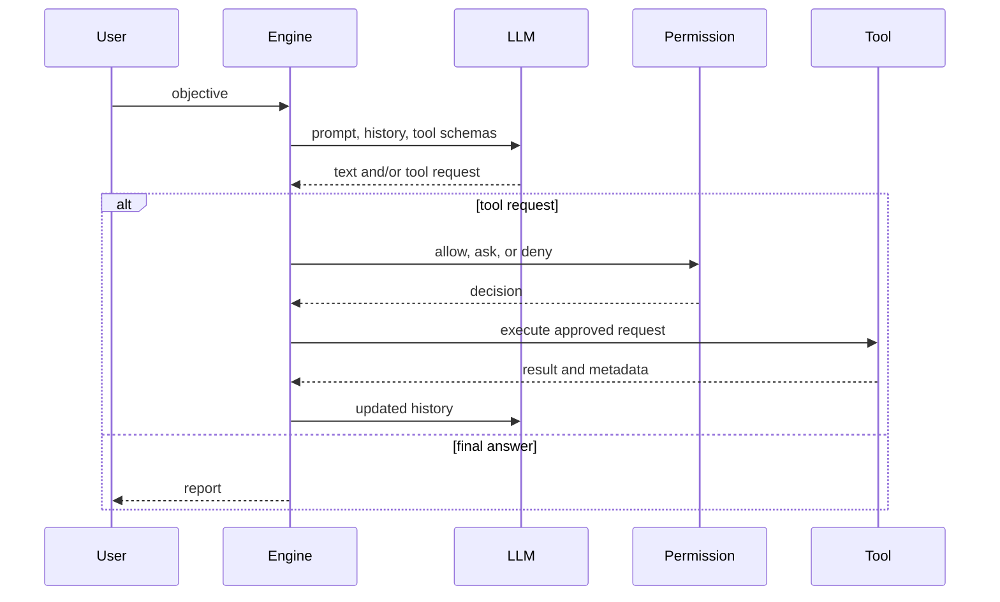

# AutoXRD Core Framework

This document describes the current AutoXRD runtime and scientific core that
are distributed in the public package. Benchmark runners, judges, experiment
records, and paper-analysis code are intentionally outside this repository.

## 1. System Scope

AutoXRD is a terminal-based code agent for powder diffraction workflows. A
user supplies measured patterns, structural models, instrument information,
existing refinement projects, or a scientific objective. The agent can then:

1. inspect the inputs and their provenance;
2. load relevant XRD skills;
3. plan a staged analysis;
4. write or modify scientific scripts and control files;
5. execute FullProf, GSAS-II, or Python tools through the shell;
6. inspect generated files and numerical diagnostics;
7. revise the workflow when evidence contradicts the current hypothesis; and
8. report results together with commands, artifacts, assumptions, and limits.

The responsibility split is deliberate:

> The LLM plans and explains. Native tools change the workspace. Scientific
> backends perform numerical computation. Deterministic modules validate
> machine-checkable evidence.

Skills are procedural instructions, not answer-producing APIs. They guide the
agent, while the agent remains responsible for using code tools and inspecting
the actual outputs.

## 2. Architecture



| Layer | Responsibility | Main implementation |
|---|---|---|
| Interaction | CLI, TUI, rendering, commands, resume | `src/tui/`, `src/commands/` |
| Agent runtime | model/tool loop, retries, usage events | `src/core/engine.py`, `src/core/llm.py` |
| Runtime control | permissions, sandbox, planning, memory | `src/core/permissions.py`, `src/features/` |
| Native tools | file inspection, editing, search, shell | `src/tools/` |
| Skill layer | discover and inject domain procedures | `src/features/skills.py`, `.autoxrd/skills/` |
| Scientific core | XRD parsing, FullProf, PCR, residuals, audit | `src/xrd/` |
| External backends | numerical refinement and simulation | FullProf, GSAS-II, scientific Python packages |

## 3. Entry Point and Configuration

`pyproject.toml` exposes the application as:

```text
autoxrd = tui.app:main
```

Typical invocations are:

```bash
autoxrd --auto-approve
autoxrd --print "Inspect sample.xy and refine the supplied structure"
autoxrd --resume 1
```

Configuration is resolved by `src/core/config.py`. AutoXRD supports an
OpenAI-compatible provider and the Anthropic wire format. Provider URL, model,
token limit, and reasoning effort can be supplied through environment variables
or `~/.autoxrd/config.toml`; API keys should remain in environment variables.
See `docs/configuration.md` for the complete precedence rules.

Scientific executables are discovered independently from the LLM provider:

- FullProf: `FULLPROF_BIN`, then `PATH`, then the managed local installation.
- FullProf documentation: optional `FULLPROF_MANUAL`.
- GSAS-II: the active Python environment or an explicit executable/module path
  selected by the user workflow.

## 4. Agent Runtime

### 4.1 Model and tool loop

`src/core/engine.py::Engine` maintains the conversation and executes approved
tool calls until the model returns a final response.



The engine emits structured events for text, API attempts, token usage, tool
calls, execution results, waiting state, and errors. These events support the
TUI and reproducible usage accounting without coupling the core to a specific
evaluation harness.

### 4.2 Provider behavior

`src/core/llm.py` normalizes OpenAI-compatible and Anthropic messages into one
internal representation. It handles streaming text, structured tool calls,
usage records, retryable transport errors, rate limits, context overflow, and
turn cancellation. A bounded non-stream adapter is used for known compatible
endpoints that do not reliably terminate streamed responses.

Optional strict controls can require the returned model identifier to match the
requested model and reject tool-call markup returned as ordinary text. These
controls are disabled by default and are useful when provenance requirements
are stricter than ordinary interactive use.

### 4.3 Sessions and long tasks

| Module | Role |
|---|---|
| `src/core/session.py` | append-only conversation persistence and resume |
| `src/features/compact.py` | context compaction |
| `src/features/memory.py` | persistent user/project memory |
| `src/features/cost_tracker.py` | per-turn token and API-duration accounting |
| `src/features/plan.py` | read-only planning state |
| `src/features/todo.py` | task tracking |
| `src/features/agents/` | optional worker and exploration agents |

An optional maximum tool-call budget can be attached to an engine instance.
When enabled, progress notices tell the model how many calls remain and reserve
the final calls for required deliverables. Interactive AutoXRD does not impose
such a budget unless configured by the caller.

## 5. Native Tool Surface

The normal interactive runtime exposes:

| Category | Tools |
|---|---|
| Read and search | `Read`, `Glob`, `Grep` |
| Modify files | `Edit`, `Write` |
| Execute code | `Bash` |
| User interaction | `AskUserQuestion` |
| Planning | plan and todo tools |
| Optional coordination | agent and task-management tools |

`PermissionChecker` combines the selected approval mode, plan state, and
sandbox policy. The Bash tool runs commands from the active workspace, captures
stdout/stderr, reports return codes and duration, terminates the complete process
group on timeout, and supports a caller-pinned working directory.

AutoXRD intentionally does not reduce scientific work to tools such as
`identify_phase` or `run_refinement`. The native code surface lets the model
write a task-specific workflow, execute the real backend, inspect intermediate
state, and revise it.

## 6. Skill System

### 6.1 Discovery

`src/features/skills.py` reads `SKILL.md` files with YAML frontmatter. Skills
are loaded in this order:

1. XRD skills packaged with AutoXRD;
2. user skills under `~/.autoxrd/skills/`;
3. project skills under `<workspace>/.autoxrd/skills/`.

Later locations can override a same-named skill. `AUTOXRD_SKILLS_DIR` may point
to an alternate packaged-skill directory for development or deployment.

### 6.2 Packaged XRD skills

| Skill | Purpose |
|---|---|
| `xrd-pattern-qc` | audit range, sampling, noise, intensity, and peak resolution |
| `xrd-structure-audit` | inspect CIF formula, symmetry, cell, sites, occupancy, and distances |
| `gsasii-executable-workflow` | build auditable GSAS-II scripts and preserve GPX/LST outputs |
| `fullprof-le-bail` | initialize and diagnose profile matching with FullProf |
| `fullprof-pcr-compiler` | translate structured actions into guarded PCR modifications |
| `fullprof-staged-refinement` | plan staged Le Bail, Rietveld, and QPA workflows |
| `xrd-residual-features` | compute observed-minus-calculated residual morphology |
| `xrd-residual-diagnosis` | rank mechanisms and propose falsifiable next actions |
| `xrd-trajectory-gate` | compare before/after evidence and accept or reject a step |
| `xrd-physical-audit` | audit final structure, fractions, correlations, and uncertainty |

The wheel includes all ten skill documents. They are prompt-time scientific
guidance and can reference deterministic modules, external programs, and files
that the agent must actually execute or inspect.

## 7. Deterministic XRD Core

| Module | Implemented responsibility |
|---|---|
| `src/xrd/pattern.py` | read common text, JSON, XRDML, and CPI patterns; compute QC |
| `src/xrd/structure.py` | parse CIFs, fingerprint structures, run conservative audits |
| `src/xrd/pcr.py` | PCR semantic catalog, action validation, guarded compilation |
| `src/xrd/fullprof.py` | execute FullProf and parse fit/convergence metrics |
| `src/xrd/le_bail.py` | construct and validate a first Le Bail run |
| `src/xrd/residual.py` | derive residual features from observed/calculated data or PRF |
| `src/xrd/schemas.py` | typed action, evidence, snapshot, and gate contracts |
| `src/xrd/trajectory.py` | validate actions, decide transitions, preserve a hash-linked ledger |

These modules provide machine-checkable operations. They do not replace the
agent's responsibility to choose an appropriate scientific model.

### 7.1 Pattern and structure audits

Pattern QC checks monotonicity, duplicate coordinates, median and irregular
step size, intensity pathologies, noise, peak sampling, and warnings. It does
not infer missing radiation metadata from peak locations.

Structure audit checks parseability, formula, lattice, space group, atomic
sites, occupancy, and minimum distances. Passing the audit means that no known
hard violation was found; it does not prove phase identity.

### 7.2 FullProf adapter

The FullProf adapter creates an isolated run directory, invokes `fp2k`, records
stdout, stderr, return code, duration, and timeout state, then parses available
`Rp`, `Rwp`, `Rexp`, chi-squared, Bragg R, phase fractions, convergence state,
and warnings. Original inputs are preserved.

### 7.3 Guarded PCR compiler

PCR files are position-sensitive and use numerical codewords and shared
constraint groups. Direct text editing can unintentionally release parameters
outside the intended action. `src/xrd/pcr.py` provides an optional controlled
path:

1. parse anchored values, codewords, controls, and constraint groups;
2. verify the source-template hash;
3. freeze catalogued refinable parameters;
4. release only selectors named by a typed action;
5. reject unsupported or cross-boundary constraints;
6. emit a new PCR and provenance without overwriting the source.

The validated compiler currently covers scale, zero shift, polynomial
background, lattice, profile, and asymmetry for supported constant-wavelength
templates. Atomic coordinates, displacement factors, occupancy, preferred
orientation, and size/strain are not yet guaranteed by this compiler.

This is not the only way AutoXRD can run FullProf. The agent may edit or generate
a PCR through native code tools and execute FullProf directly, but that route
does not receive selector-level safety guarantees. Users should therefore
require explicit bounds, preserved inputs, output inspection, and physical audit
for unsupported parameters.

### 7.4 GSAS-II execution

GSAS-II is exposed through its normal Python interface rather than a fixed
answer tool. The agent can write a `GSASIIscriptable` workflow, import pattern
and instrument files, construct phases, refine in stages, and save GPX, LST,
profile, and report artifacts. Its available parameter surface is determined by
the installed GSAS-II version and the script written for the task.

## 8. Evidence-Grounded State Transitions

`src/xrd/schemas.py` represents a refinement transition with typed evidence,
falsifiable predictions, a bounded action, a before/after fit snapshot, and a
gate decision. The stage vocabulary covers quality control, profile matching,
instrument, structure, microstructure, and final audit.

`src/xrd/trajectory.py` can check:

- whether an action is appropriate for the current stage;
- whether a high-risk action has bounds;
- whether strongly coupled parameters were released together without support;
- whether predicted residual changes occurred;
- whether physical violations appeared;
- whether fit improvement justifies added complexity; and
- whether correlation or unexplained-peak diagnostics worsened.

Low `Rwp` alone is not proof of a correct model. A step can be rejected when its
mechanistic prediction fails, its physical validity deteriorates, or its added
complexity is unsupported.

`TrajectoryStore` can persist transitions as an append-only SHA-256-linked
ledger connecting parent state, evidence, action, commands, artifact hashes,
after state, prediction checks, and the decision. The hash chain supports
reproducibility and tamper evidence; it is not a security boundary against an
administrator who controls the workspace.

These validators are invoked when a workflow or skill calls them. The ordinary
TUI does not silently intercept every scientific file change or automatically
approve every final result.

## 9. End-to-End Workflow

A recommended staged workflow is:

```text
Inspect inputs and metadata
  -> pattern QC and structure audit
  -> choose backend and establish a baseline
  -> execute the smallest justified parameter release
  -> inspect convergence, residuals, correlations, and files
  -> accept, reject, or revise the action
  -> repeat only while evidence supports added complexity
  -> run final physical/provenance audit
  -> deliver report plus reproducible artifacts
```

The exact workflow is task dependent. Phase identification, indexing, peak
analysis, pattern prediction, multiphase quantification, and full structural
refinement need different scripts and evidence. Skills define reusable expert
principles while leaving those choices to the agent.

## 10. Packaging Boundary

The public package contains:

- the CLI/TUI and agent runtime;
- native tools, permissions, sandbox support, sessions, and memory;
- ten packaged XRD skills;
- deterministic XRD modules;
- configuration and installation documentation; and
- unit and integration tests for the core.

It intentionally excludes experiment-only benchmark cases, runner scripts,
judge prompts, model credentials, result logs, paper artifacts, and downloaded
research datasets. This separation keeps the installable framework reusable and
prevents evaluation protocols from becoming implicit runtime behavior.

## 11. Current Scientific Boundaries

- AutoXRD assists scientific analysis; it does not certify a structure.
- FullProf and GSAS-II are external programs and must be installed separately.
- The guarded PCR compiler supports a conservative subset of FullProf
  parameters and templates.
- Direct code-driven workflows can access broader backend functionality but do
  not inherit the compiler's selector-level guarantees.
- R factors are precision diagnostics and must be interpreted with residual,
  physical, identifiability, and provenance evidence.
- Missing wavelength, geometry, calibration, or uncertainty metadata must be
  reported rather than silently guessed.
- Final claims should distinguish measured evidence, model assumptions, derived
  quantities, and unresolved ambiguity.

## 12. Extension Points

New capabilities can be added without changing the core loop:

- add a `SKILL.md` under a user or project skill directory;
- add a deterministic parser or validator under `src/xrd/`;
- expose a new native tool through the existing tool registry;
- configure another OpenAI-compatible endpoint;
- implement a scientific workflow as a versioned script that produces auditable
  files; or
- extend the PCR compiler only after adding bounds, restraint handling, output
  parsing, and regression tests for the new selector family.

The design principle is to keep scientific judgment in explicit procedures,
state changes in executable tools, and acceptance claims tied to inspectable
evidence.
